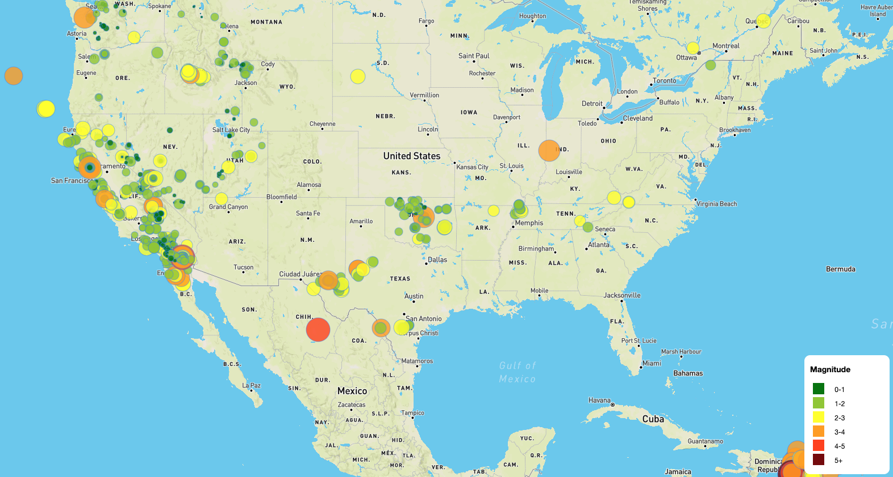

# leaflet-challenge

## Description
We have been tasked to create a visualization tool on earthquake data from the past 7 days (updated every 5 minutes). The generated map in this repository will provide the locations of earthquakes and the depths of the magnitude which can be referenced in the legend.

## How to Run Code
Clone this repository and open the HTML file to access the map.

## Results
Here is a preview of what the generated map looks like:
